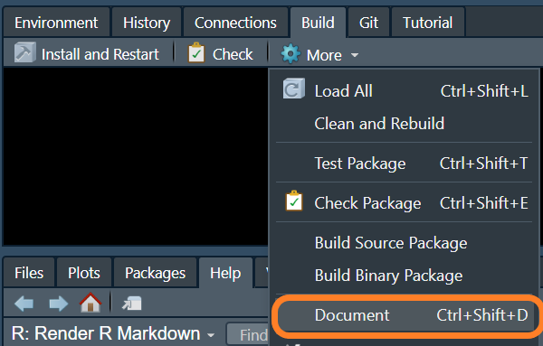
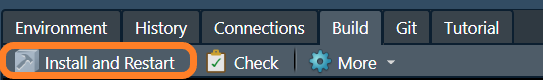

## Document Your Function
.pull-left[
- After you've written your function, you need to document each of the arguments, include examples, and any other pertinent information. 
  - Use the {roxygen2} comments package to document your function. 
  - The {roxygen2} comments begin with `#'` and use tags like `@param`, `@export`, and `@examples` to generate the help file code.

  
]

--

.pull-right[
```r
#' Title
#'
#' @param x 
#'
#' @return
#' @export
#'
#' @examples
foo <- function(x) {
  # check input is numeric
  stopifnot(is.numeric(x))
  
  # return the mean
  mean(x)
}
```
]

---
## Document Your Function

.pull-left[
```r
#' Calculate the Mean 
#'
#' @param x a numeric vector
#'
#' @return numeric scaler
#' @export
#'
#' @examples
#' foo(mtcars$mpg)
foo <- function(x) {
  # check input is numeric
  stopifnot(is.numeric(x))
  
  # return the mean
  mean(x)
}
```
]
.pull-right[
* Each time you update the roxygen comments, you must re-document the package (Ctrl+Shift+D in RStudio)

  
]

---
## Building Pkg with Your Function

* After you've written a function (or half of a function) and documented it, you'll want to do some ad-hoc testing.

* Build + Install the package by clicking the "Build and Restart" button in the "Build" tab.

  
  
* You can also load the package (including exported and non-exported objects) with `devtools::load_all()` or Ctrl+Shift+L in RStudio