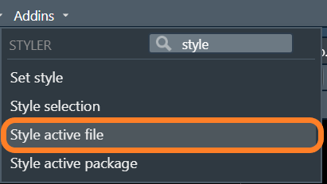

## Make it CUTE!

* Most open-source projects follow a style guidelines.

* All the Epi/Biostat R packages follow the tidyverse/google style guide.

* Even if you're not familiar with the styles in the guide, you can easily conform your code using the {styler} package.

  
