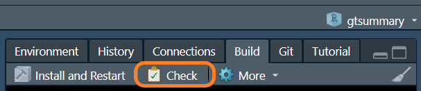
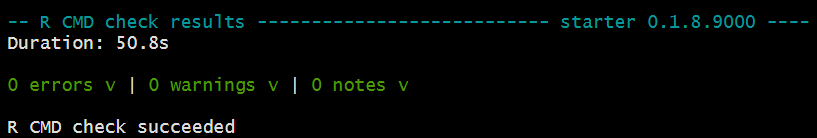
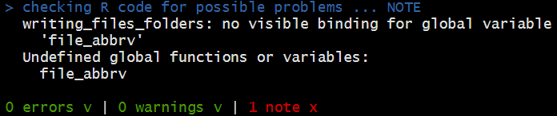

## R CMD Checks


<br>
--
What is checked? Here's a very abbreviated list
.pull-left[
* package structure
  - hidden files/folders
  - portable file names
  - executable files
  - package subdirectories
  - left-over files

* DESCRIPTION/NAMESPACE file    
  - package dependencies
  - files exist
  - NAMESPACE parses properly
]
.pull-right[
* R code
  - non-ASCII characters
  - syntax errors
  - dependencies in R code
  - S3 generic/method consistency
  
* documentation
  - Rd/help files
  - Rd file metadata
  - examples
  - undocumented function arguments
]

---
## Checks

Review results and check there are zero errors, warnings, and notes.


<br>A common note is about **undefined global variables**. This most often occurs when using {dplyr} verbs without the `.data` prefix.

.pull-left[
```r
# bad syntax
mtcars |> mutate(mpg10 = mpg * 10)
```
]
.pull-right[
```r
# good syntax
mtcars |> mutate(mpg10 = .data$mpg * 10)
```
]




---
## Spell Check

.pull-left[
One last check...the spell check!

```r
usethis::use_spell_check()
```
]
.pull-right[

]

