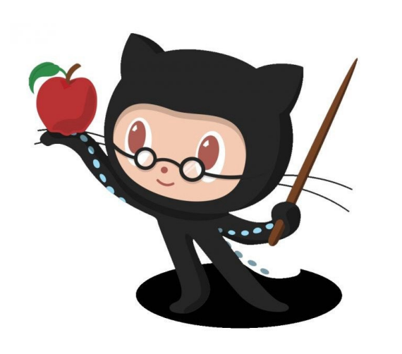

```{r setup, include=FALSE, warning=FALSE}
knitr::opts_chunk$set(echo = TRUE, warning = FALSE)

set.seed(78987)
library(xaringanthemer)
library(tidyverse)
library(cowplot)

style_mono_accent(
  base_color = mskRvis::msk_palette("main")[1]
)

# xaringan::inf_mr() 
options(htmltools.dir.version = FALSE) 
```

```{r xaringanExtra-freezeframe, echo=FALSE}
xaringanExtra::use_freezeframe()
```

class: inverse, center, title-slide, middle

# Everything You Wanted to Know About Contributing to an R Package

## *But Were Too Afraid to Ask*

### Daniel D. Sjoberg

#### April 4, 2022


<p align="center"></p>

.medium[
`r icons::fontawesome("twitter") %>% icons::icon_style(fill = "#FFFFFF")` @statistishdan

`r icons::fontawesome("github")  %>% icons::icon_style(fill = "#FFFFFF")` @ddsjoberg
]

---
```{r child='01-background.Rmd'}
```

---
```{r child='02-getting_started.Rmd'}
```

---
```{r child='03-roxygen.Rmd'}
```

---
```{r child='04-style.Rmd'}
```

---
```{r child='05-unit_tests.Rmd'}
```

---
```{r child='06-checks.Rmd'}
```

---
```{r child='07-pull_request.Rmd'}
```

---
## Let's Practice

.pull-left[.xxlarge[
We'll now walk through an example by submitting a pull request to the {tidycmprsk} package. [https://github.com/MSKCC-Epi-Bio/tidycmprsk](https://github.com/MSKCC-Epi-Bio/tidycmprsk)

Any questions before we begin?
]]
.pull-right[

]

